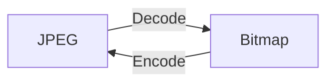
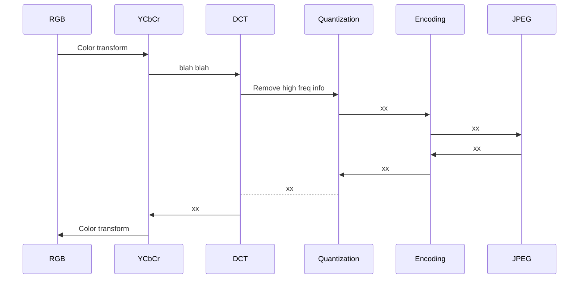

> A continuación se detalla el proceso de codificación y descodificación usado
> por el estándar JPEG y se realiza una implementación en Python.

 
    [ <a href='https://github.com/daniellerch/stegolab/tree/master/codes/pure-python-jpeg.py'>
        Código en GitHub
      </a> ]

1. [Introducción](#introducción)
2. [Esquema general](#esquema-general)
10. [Referencias](#referencias)

 
## Introducción

En este artículo se describe el proceso de codificación y descodificación
de imágenes JPEG paso a paso. Cada parte del proceso se acompaña de un
ejemplo de implementación en Python. La codificación y descodificación
completa, en forma de librería, se puede encontrar 
[aquí](https://github.com/daniellerch/stegolab/tree/master/codes/pure-python-jpeg.py).

En la sección de [referencias](#referencias) hay una lista detallada de los 
diferentes recursos usados para la realización de este artículo, así como de los 
documentos en los que se especifica el estandar JPEG.

Este artículo se ha desarrollado en el contexto de la esteganografía, para la
que es especialmente importante conocer el medio en el que se oculta la
información. Concretamente, en el caso de JPEG, conviene conocer a fondo todo
lo relacionado a los coeficientes DCT.

Sin embargo, lectores interesados en JPEG sin ninguna relación con la 
esteganografía, pueden encontrar igualmente útil este artículo.

 
## Esquema general

Cuando queremos visualizar una imagen JPEG, necesitamos una herramienta que
se encargue de leer el archivo JPEG, descodificarlo y mostrarnos su contenido. 
De la misma manera, cuando queremos guardar una imagen representada como un
[mapa de bits](https://en.wikipedia.org/wiki/Bitmap), en JPEG, necesitamos 
una herramienta que se encargue de realizar la codificación. Por ello, en el uso 
habitual de JPEG, siempre estaremos codificando mapas de bits a JPEG y 
descodificando JPEG a mapas de bits.

El proceso definido por el estándar JPEG para realizar la codificación de 
una imagen representada como mapa de bits se puede ver en el siguiente
diagrama. Este proceso, permite eliminar mucha información innecesaria
que nos permitirá obtener una imagen de un tamaño muy inferior al de la
imagen original representada mediante un mapa de bits.

EN DESARROLLO ...

 
## Referencias

1. [JPEG standard, ITU-81](https://www.w3.org/Graphics/JPEG/itu-t81.pdf).
2. [JPEG File Interchange Format](https://www.w3.org/Graphics/JPEG/jfif3.pdf).
3. [JPEG](https://en.wikipedia.org/wiki/JPEG) (Wikipedia).
4. [Let's Write a Simple JPEG Library](https://koushtav.me/jpeg/tutorial/2017/11/25/lets-write-a-simple-jpeg-library-part-1/).

